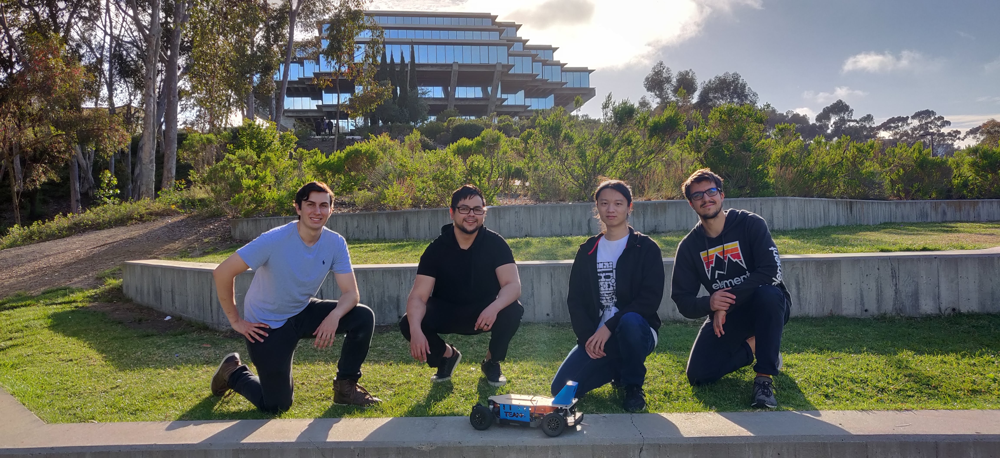
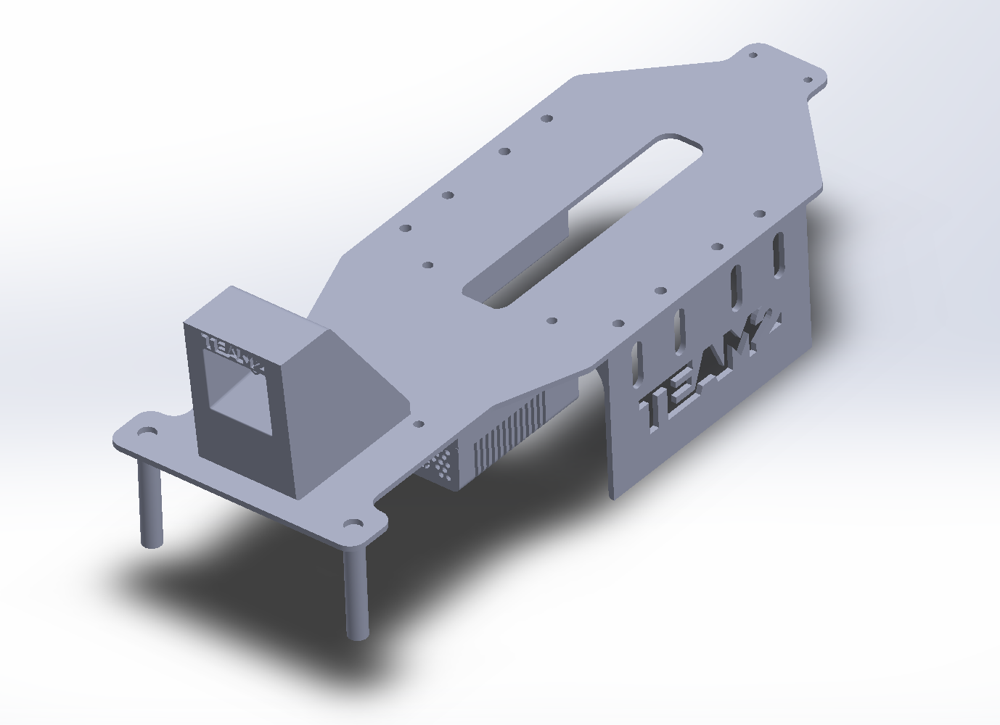
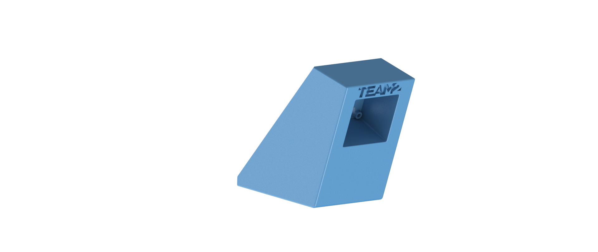
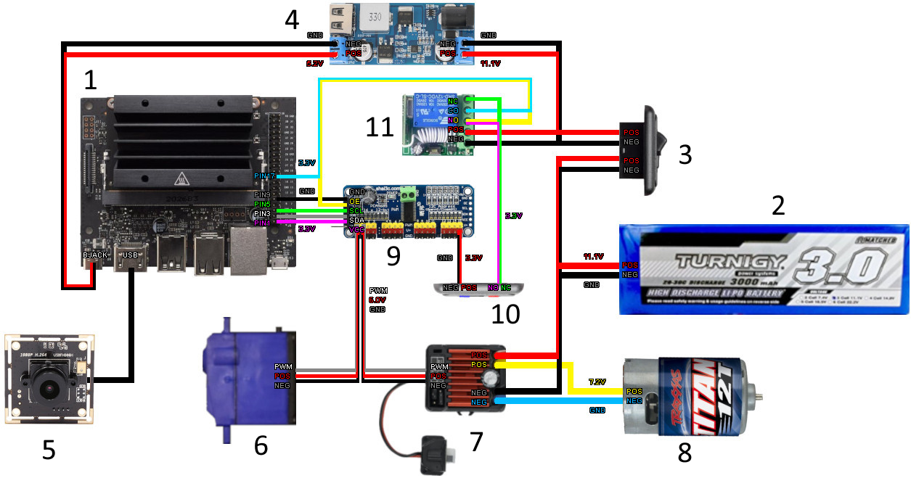
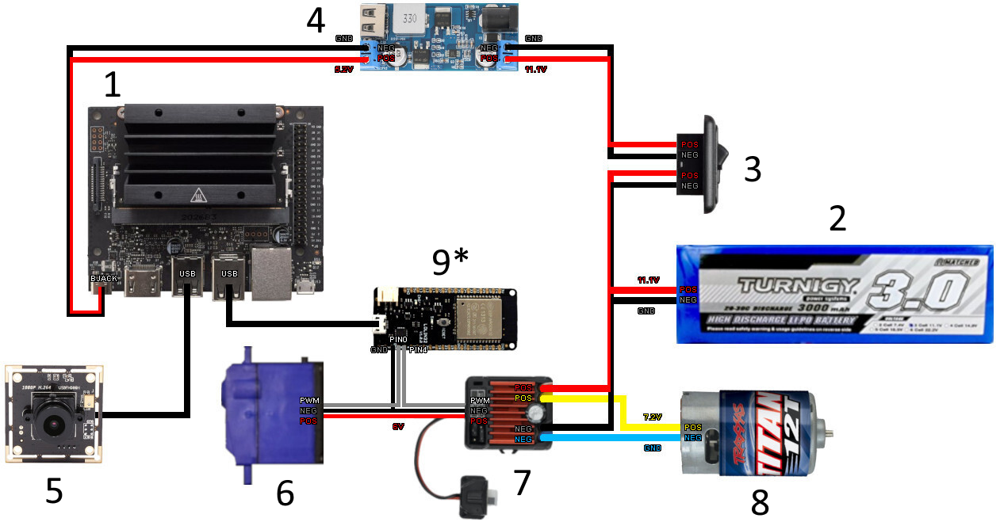
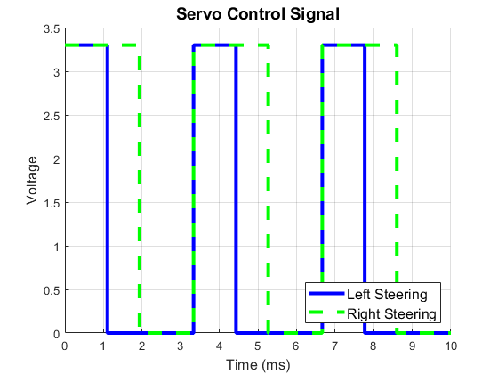
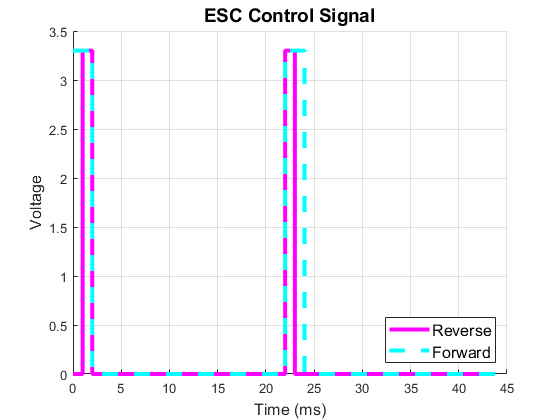

# MAE/ECE 148 - Spring 2021

## Team Members
- Ari Cortes – ECE Senior 
- Antoine Laget – CSE Senior (UCSD Extension) 
- Kevin Lam – MAE Senior 
- Jack Ringelberg – MAE Senior 

## Project Overview
In this class, students are tasked with programming a remote control (RC) car to navigate a track autonomously. This is first accomplished by using deep learning to train an artificial intelligence (AI) model with the Donkey Car framework, and then tackled using Robot Operating System (ROS) to implement image processing and lane-following algorithms. In both cases, training and tuning result in a lot of eccentric behavior and crashes, so an emergency stop is implemented to minimize accidents. Currently, a relay controlled by a wireless clicker disables the PCA9685 pulse-width modulation (PWM) board, stopping steering and throttle commands from reaching the servo and motor. This assembly is not ideal because it is bulky, requires a lot of jumper wires, and causes the car to coast to a stop rather than brake. The goal of this project is to replace the relay and PWM board assembly with a single ESP32 wi-fi capable microcontroller. The ESP32 will generate PWM signals to control the servo and motor and will receive emergency stop commands through wi-fi from a user's phone or computer.

  

### Must Haves
- ESP32 generates PWM signals based on commands from Jetson Nano to control the servo and motor.
- ESP32 functions as an access point for a phone or computer to connect to.
- Website with a red button activates an emergency stop.

### Nice to Haves
- Heartbeat and watchdog to shutdown car when wi-fi connection or serial connection with Jetson is lost.
- Expand website to include additional functions beyond emergency stop.

### Project Video
https://user-images.githubusercontent.com/48296282/155657464-22e83d6a-a38e-4d38-88a1-f9853daaf8ed.mp4

## Mechanical Design
The major components of the mechanical design include the baseplate, camera mount, and Jetson Nano case.

  

### Baseplate
Starting from a high-contrast image of the car chassis, the baseplate was designed to conform to the existing body shape of the RC car. A central slot allows for easy wire passthrough for cameras and circuitry. A reversible design allows for ease of electrical debugging, and once that's working, simply flipping over the plate protects the electronics from collisions.

  

### Camera Mount
Multiple camera mount design iterations were tested over the course of the quarter. Starting with an adjustable design, once an ideal camera angle was chosen, a sturdy rigid mount was used to provide ample camera protection.

  
  

## Electrical Design
The car's electrical assembly consists of eleven main components:

1. Jetson Nano – The single board computer (SBC) in charge of controlling the remote control car.
2. Three Cell LiPo Battery and Alarm– The power source for the car. An alarm is attached to notify the user when the battery charge has depleted.
3. Power Switch – Switches power to all components on the car except the electronic speed controller (ESC).
4. DC-DC Converter – Regulates the battery voltage (anywhere from ~10-12V during operation) to a constant 5V.
5. USB Camera – Camera connected to the Jetson via USB cable to provide a live video feed.
6. Servo – Steers the car.
7. Electronic Speed Controller (ESC) and Switch – Controls the DC motor based on commands from the PWM board and provides power to the servo. The ESC can be switched on or off.
8. Brushless DC Motor – Drives the car's four wheels.
9. PCA9685 Pusle-Width Modulation (PWM) Board – Receives commands from the Jetson Nano via I2C communication to control the steering and throttle. Generates PWM signals to send to the servo and to the ESC to be then sent to the motor. Also provides power for the status LED light.
10. Status Light-Emitting Diode (LED) – LED light denoting enabled or disabled state of the car.
11. Emergency Stop Relay – The relay is connected to a wireless remote which switches 3.3V power from the common (CO) terminal between the normally closed (NC) and normally open (NO) terminals. The disable pin (OE) of the PWM board is connected to the NC terminal, stopping generation of PWM signals when switched and therefore shutting down the steering and throttle. To denote the enabled and disabled conditions, the blue light is connected to the NC terminal of the relay and the red light is connected to the NO terminal.

The ESP32 (component 9* in the new diagram) replaces components 9, 10, and 11. The ESP32 communicates with the Jetson Nano via serial communication through a USB cable. Pin 0 and 4 of the ESP32, which are capable of generating PWM signals, are connected to the PWM inputs to the servo and ESC, respectively. The 6V power output from the ESC is connected to the servo. The servo, ESC, and ESP32 are all grounded to the Jetson.

## Software
This Code was written using VSCode and the PlatformIO extension for use on the ESP32-DevKitC micro controller. Code for flashing the ESP32 can be found under nodeMCU-32S-DualCore/src/main.cpp .
We also recommend using Platform.io for developing on the ESP32, which helps in flashing the webserver Javascript code to the ESP32. 
The Javascript code is found under nodeMCU-32S-DualCore/data/ . 
Configuring a new ESP32 device is simple, just change the Wifi SSID and password parameters.

An example for reading and sending JSON strings through serial can be found under scripts. 
These existing scripts subscribe to ROS /throttle and /steering topics, packaging and sending them over Serial.

This repository is set up to be easily git-cloned as a ROS package. 
Simply create a new package and clone the contents of this repository into the package folder, making sure to edit the package name as necessary.

Also included under mechanical/ are CAD files for camera mounts, base plates, and protective walls which we used on our car. Feel free to alter and use these files.

Further project details and video demostration can be found here: [ESP32 Web Server Project](https://docs.google.com/document/d/1h9dRktVf6lAae34t0Z2zWiOfpSByz_bvqmT_pmIQF1w/edit#)

### Website Code
The website server code is divided into 3 parts: HTML, CSS, and JavaScript. The HTML governs the look of the site, CSS handles the layout, and JavaScript handles the button events. In order to push the server data onto the ESP32, you need to store the website code in a folder named data and upload a filesystem image via platformio.

### Websockets and Syncronization
Device syncronization is handled via main.cpp and server code. Whenever a button is pressed on a device, javascript sends a JSON message over serial to the esp32, and the button lights up to indicate it has been pressed. The JSON message is then deserialized and the buttons on the server are updated using the new values. The main.cpp code then sends a websocket "text" over serial to all connected devices notifying them of the change. The "text" messages are then deserialized via javascript on each device and the buttons' CSS are updated.
Website Team 2.png
Figure 8: Website User Interface

### Serial Communication
The Jetson and ESP32 use serial communication through a USB cable. The Jetson sends steering and throttle commands to the ESP32 in the form of a JSON formated message, which is a formatted string that provides a normalized throttle and steering value between -1 and 1. A typical JSON message looks like this:

{"throttle": 0.00, "steering": 0.00}

The ESP32 decodes this message and sends the proper signals to the servo and ESC to achieve the desired normalized steering and throttle values. The ESP32 is also able to send JSONs back to the Jetson, which was initially used to confirm that the command has been received properly. However, new items can be easily appended to the JSON so that the ESP32 can send back commands to the Jetson to change model or ROS parameters, for example allowing the user to make live changes to the ROS color filter:

{"throttle": 0.00, "steering": 0.00, "hue_lower": 30, "hue_upper": 80}

We decided to use JSON format because it is a well documented and a computer science standard. JSON is human readable and easily scalable for further developpement.

### PWM Signal Generation
For the servo PWM signal generated at pin 0, the command ledcWrite was used to generate a 3.3V PWM signal of varying duty cycle based on a normalized steering command between -1 and 1 from the Jetson . For a PWM frequency of 300 Hz, a 33% duty cycle was found to correspond to full left steering and 58% corresponded to full right. Visualization of this signal is provided below:

  

It was found that the ESC does not function with a fixed-frequency PWM signal. Instead, the ESC requires a 20 millisecond low period followed by a 1-2 millisecond high (3.3V) pulse. 1 millisecond high corresponds to full reverse rotation of the motor and 2 milliseconds corresponds to full forward rotation. To generate such a signal, the writeMicroseconds command from the ESP32Servo Library was used to modulate the duration of the 3.3V pulse generated at pin 4. The visualization of this signal is shown below:

  

### Watchdog
The ESP32 has a watchdog which trips whenever it takes longer than 200 milliseconds to receive a new command from the Jetson, which happens when the Jetson freezes or crashes. This watchdog forces the ESP32 into a backup routine where it shuts down the steering and throttle and waits 3 seconds before checking if the Jetson is back online. If the serial connection is restored and new messages are received, the ESP32 will resume normal operation, otherwise it will continue to run the backup routine.

### Jetson Nano Code
On the Jetson Nano, provided image processing and vehicle control nodes output throttle and steering topics. These topics are parsed by our ESPcomms_ROS node and formatted as a JSON string for serial passing to the ESP32.

## Donkey Car Deep Learning Autonomous Laps
https://user-images.githubusercontent.com/48296282/155657678-b7dbbe47-a2a7-4cd7-b7a3-5134e3d5e2b7.mp4

## ROS Autonomous Laps
https://user-images.githubusercontent.com/48296282/155658084-4c5eddea-c2ed-4278-b611-a1a722951d49.mp4

## ESP32 with E-Stop
https://user-images.githubusercontent.com/48296282/155658390-382dc491-0541-4934-8ede-7804751b5ee2.mp4

## Advice and Future Suggestions
- Build to Crash - No matter how carefully you drive, you will probably crash a lot! A lot of collisions occur between cars and are often not your fault. The best way to prepare for this is to ensure your mechanical parts are beefy and electrical components are covered.
- Get Driving ASAP - Training a deep learning model at the tent track was a particularly difficult task due to the constantly changing lighting conditions. It was critical to start training early to ensure there was enough time to work out any kinks and develop a robust model. Listen to Professor Silberman and send your parts out to be manufactured in the first week!
- Expanding ESP32 Website Functionality - Possible functions to add to the website include live calibration of steering and throttle, live color filter adjustment, and live PID controller tuning.
- Creating Class for DonkeyCar Implementation - Similarly to how the ESPcomms_ROS node was added to send steering and throttle controls over serial for the ROS framework, an ESP32 class can be added to the DonkeyCar steering and throttle code to send commands to the ESP32 over serial based on inputs from the driver or AI model.
- We recommend the WEMOS ESP32 (Rather than LOLIN) board, which goes into flashing mode only when you hold a button, rather than always looking to download code through serial.
- We recommend using platform.io for javascript flashing.
- Developing a PCB for attaching PWM cables will make things cleaner, consider a flat back for velcro mounting or thru holes for more screw mounting.
- Reset ESP32 remotely using the EN pin through Jetson, rather than having to press the button on the board.

## Acknowledgements
- Team 1 - Thank you for helping us determine the proper PWM signals to send to the motor and servo.
- Dominic and Haoru - Thank you for debugging with us throughout the quarter.
- Professor Silberman and Professor de Oliveira - Thank you for providing a priceless learning opportunity!

## References
- ESP32 PWM with Arduino IDE, RandomNerdTutorials.com, 2021.
- ESP32Servo Library, John K. Bennett, 2017.
- Thingiverse Jetson Nano Case by ecoiras
